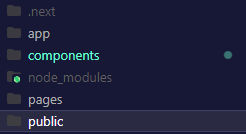
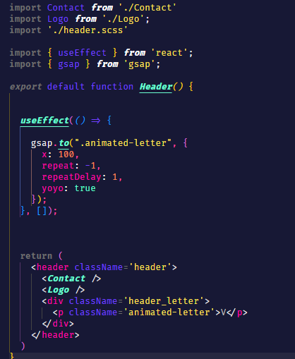

# NEXTJS v13

- error 1 :

 

In this version of Next, we have a `app` folder and everything contained in this folder is done on the server-components
[ressources](https://beta.nextjs.org/docs/rendering/server-and-client-components)

In my case, I would like to use the useEffect to create a animation in a header component.

I got this error while setting a hook useEffect but it's the same for useState, etc...

error message : `You're importing a component that needs useEffect. It only works in a Client Component but none of its parents are marked with "use client", so they're Server Components by default.`

To fix this error, you just have to specify that it is a client-side component
writing `'use client';` in the first line of your component.
